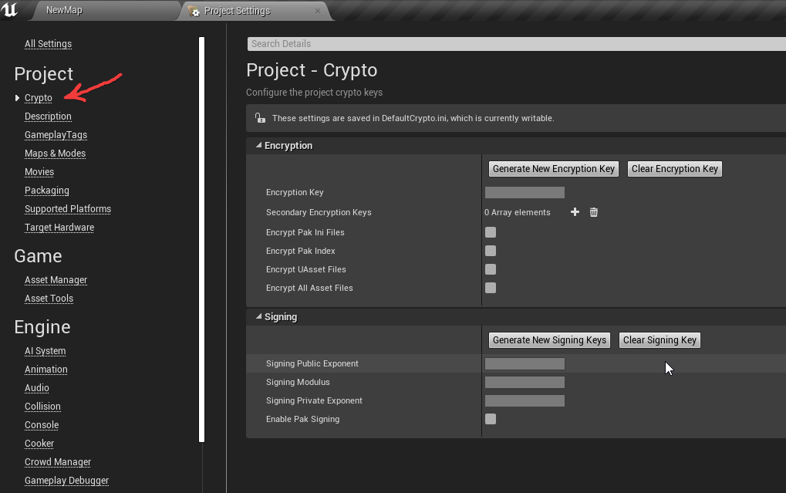

# **UE4 Yandex Speech Kit**


This is UE4 wrapper for [Yandex Speech Kit](https://cloud.yandex.ru/services/speechkit) **speech recognition** and **synthesis** cloud services.

Plugin was battle tested in several commercial simulator projects.
The creators of the service are based in **Russia**, so russian language recognition and synthesis are there and it is main language with all features supported.

# Preparation
1) Go to [cloud console](https://console.cloud.yandex.ru/) and create service account [with **editor** or **admin** role](https://cloud.yandex.ru/docs/speechkit/security/). (1 month trial access available)
2) [Create API key](https://cloud.yandex.ru/docs/iam/operations/api-key/create).
3) There are two ways how you can use your credentials.

    * 3.1 By using environment variables. Create environment variable `YANDEX_API_KEY` with created key as value.

    * 3.2 By assigning key directly in blueprints. This can be called anywhere.

    

    By default you need to set api key from nodes. To use environment variable, you need to set `SetUseApiKeyFromEnvironmentVars` to `true`.

> **ADVICE**: Pay attention to security and encrypt your assets before packaging.



# Speech synthesis

You need to supply **text** or **ssml** markup to async node, as well as **audio quality**, **voice variant**, **speed** and **emotion**. As output you will get
sound wave object which can be played by engine.


# Speech recognition

Consists of two parts. First, we need to record voice from microphone. To do that, use provided **YandexMicrophoneCapture**
actor component as shown below. Next, construct recognition parameters and pass them to **Yandex STT** async node.


Probably you will need to send voice commands to you app, to increase recognition chances use `CompareStrings` node. Below call will return 0.454545 value,
so we can treat those strings not equal, since they are similar on 45%.


# Important steps

To make microphone work, you need to add following lines to `Engine.ini` of the project.
```
[Voice]
bEnabled=true
```

To not loose pauses in between words, you probably want to check silence detection treshold `voice.SilenceDetectionThreshold`, value `0.01` is good.
This also goes to `Engine.ini`.

```
[SystemSettings]
voice.SilenceDetectionThreshold=0.01
```

Or by executing console command during runtime


# Platforms supported

**Windows**

# Links
Find out more in [api documentation](https://cloud.yandex.ru/docs/speechkit/) for corresponding sections.
